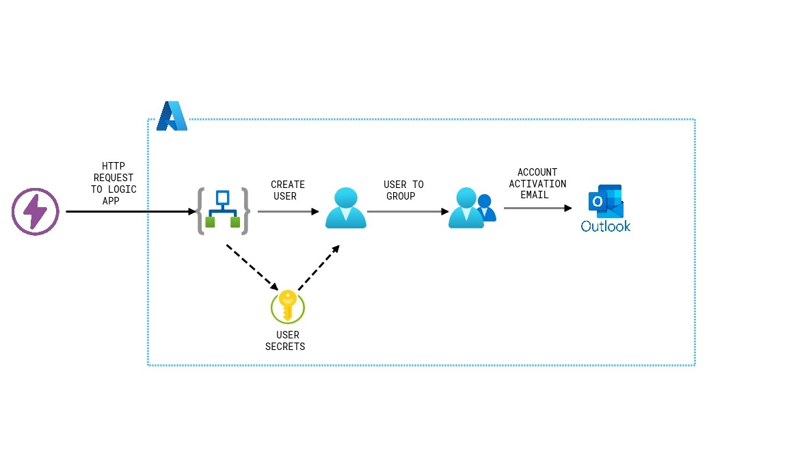

# Azure-Automated-Onboarder
The azure automated onboarder is a logic app I've created in Azure to automate teh onboarding process of a new employee with the company. This logic app utilizes key vault secrets, AzureAD and outlook API connections.

## Architecture

### How it works
The logic app is triggered by an HTTP requesto to the logic app. For this process I used Thunder Client to generate and send the request to the application. Once the Request is recieved, The logic app uses its managed identity permissions access to grab the standard user password from the key vault it is stored in, instead of providing the password as hard code in the logic app itself.

With the HTTP request recieved and the user password secret obtained from teh vault, The app then creates a user from the required fields sent in the request. The new user is then placed into the proper group based with proper permissions and access roles.

The final step in the logic app is to send an email to the User Admin to review and activate the account. Upon creation, for security,purposes, the new user account is not active to help prevent any attempt of a milicious user being created within the tenant. 
